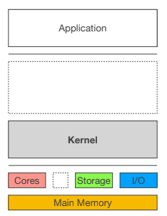

# part 1.

## 컴퓨터 시스템

### 컴퓨터 시스템의 구성요소

컴퓨터는 소프트웨어와 하드웨어로 구성된다. 소프트웨어는 크게 어플리케이션과 OS로 나눌 수 있다. 어플리케이션, OS, 하드웨어를 합쳐서 컴퓨터 시스템이라 부른다.

- 어플리케이션은 다양한 **자원을 사용(resource usage)**한 **작업흐름(workflows)**이다.

  > 어플리케이션은 응용프로그램이다. 하드웨어와 OS가 제공하는 자원과 환경을 응용하여 문제를 해결한다.

- 하드웨어는 **다양한 자원을 가진(set of resource)** 하나의 **연산을 해주는 기계(computing machine)**를 일컫는다.

  > 컴퓨터는 한 가지 작업만 가능하다.

  > 컴퓨터는 compute + er -> 계산을 해주는 것이다. 그런데, calculator 또한 caculate + or -> 계산을 해주는 것이다. ???
  >
  > 컴퓨터는 H/W 를 컨트롤 한다는 의미를 포함한다.

- OS는 **실행환경을 제공(execution environment manipulator)**하고 **자원을 조작, 관리(resouce controll, manager)** 한다.

### OS의 역할

#### 작업 흐름(사용자)의 관점

컴퓨터는 연산을 해주는 기계일 뿐이다. 따라서 컴퓨터를 구동하기 위해서 명령을 내려줘야 한다. 하지만, 컴퓨터는 사람의 행동을 이해하지 못하기 때문에 사용자는 어플리케이션을 통해 컴퓨터에게 명령을 내린다. 

반면 컴퓨터는 한 가지 작업만 할 수 있다. 따라서 어플리케이션만을 통해 동시에 여러가지 조작을 하는것이 불가능하다. OS는 이러한 조작들이 충돌하지 않도록 도와준다. 또한, 컴퓨터가 한 번에 여러가지 작업을 할 수 있도록 도와준다. 

이러한 관점에서 OS는 실행환경을 제공하여 **어플리케이션을 사용하기 쉽게 도와주는(ease of use to applications) 역할**을 한다고 할 수 있다.

#### 자원 사용(시스템)의 관점

하드웨어는 여러가지 자원의 집합이다. 어플리케이션이 어떠한 작업을 수행하기 위해서 하드웨어의 자원을 이용한다. 어플리케이션이 직접 자원을 사용한다면 여러가지 문제가 발생할 수 있다. OS는 어플리케이션 대신 자원 조작 및 관리를 해주는 **하드웨어 보호(protection to hardware)** 역할을 한다.

> 자원을 잘못 할당하여 컴퓨터가 다른 작업을 할 수 없게되는 상황 등을 막아준다.

## 하드웨어

하드웨어는 위와 같이 구성되어 있다. 크게 **프로세서**, **I/O 장치**, **메인 메모리**, **컴퓨터 버스**로 나눌 수 있다.

> 위와 같은 구조를 표준 컴퓨터 시스템 모델(standard computer system model) 이라고 한다. 표준일 뿐이지 저 구조가 전부는 아니다. 예를 들어, 컴퓨터는 프로세서, 메인메모리, I/O 장치와 이를 묶어주는 컴퓨터 버스 '만'으로 이루어져있다는 것은 틀린 말이다.
>
> 이외에도 컴퓨터의 구조에 DMA, GPGPU, AI Acc, FPGA, NVVRAM, NOR, IOMMU, HSM 등이 포함될 수 있다.

### 프로세서

보통 CPU(Central Processing Unit)를 프로세서라고 한다. **하드웨어를 제어할 수 있는 연산 회로다.** 하드웨어 제어는 control unit이, 연산은 ALU가 담당한다. 

> 개념적 구분이다. 현대의 컴퓨터에서 한 덩어리안에 구성요소들이 모두 들어있다.

CPU가 처리한 결과를 저장할 곳이 필요한데 **레지스터**가 그 역할을 한다. CPU가 실행할 프로그램(데이터, 명령어)은 메인 메모리에 담겨있는데, 레지스터에 이러한 정보를 담고 CPU가 연산할 수 있도록 한다.

> 하나의 메인 메모리에서 데이터와 명령어를 처리하는 컴퓨터 구조를 **폰 노이만 구조(Von Neumann Arch.)**라고 한다. 거의 모든 CPU가 이 구조를 사용한다. 이외에 하나의 CPU에 두 개의 메모리를 사용하는 하버드 아키텍쳐가 있다. 접근속도가 빠르지만 구조가 복잡하다.

> 현대의 폰 노이만 구조로 된 모든 컴퓨터는 보편 튜링 머신 이론에 바탕을 두고 있다. 다른 튜링 머신과 같은 동작을 한다면 튜링 완전하다고 하는데, 현실적으로 모든 컴퓨터는 기억장치가 유한하기 때문에 튜링 완전하지 않다. 하지만 만약 시간과 메모리가 충분하다면 특정 컴퓨터가 할 수 있는 일은 다른 어던 컴퓨터에서도 할 수 있다. 이를 느슨하게 튜링 완전하다고 한다.

### 메인 메모리

보통 DRAM(Dynamic Random Access Memory)이 주로 사용된다. 

> SRAM은 CPU내부의 기억장치(파이프라인, 레지스터, 캐시 등)이나 백업메모리 CMOS 등에 사용된다고 한다. 속도가 빠르지만 집적도가 낮아 고용량을 생산하기에 적당하지 않기 때문이다. DRAM은 전원이 공급되더라도 주기적으로 refresh를 해줘야한다. 반면 SRAM은 전원이 공급되는 동안 데이터가 계속 유지된다. SRAM 또한 휘발성인 것은 똑같다(전원이 없으면 데이터 유지 불가).

#### 특징

- RAM은 휘발성(volatile)을 가지고, 수정가능(rewritable)하며, 임의 접근 가능(random-accessible)하다.

  > 메모리의 어디에 있더라도 동일한 속도로 접근 가능하다.

- 컴퓨터 시스템에서 CPU가 메모리에서 레지스터로 불러올 수 있는 단위를 **word** 라고 한다. 

  > 32bit 컴퓨터의 워드는 32bit(4byte)

- 각 바이트는 고유의 주소값을 가진다.

### 명령 사이클(Instruction Cycle)

1. CPU가 PC(Program Counter; Instruction Pointer)레지스터가 가리키는 주소에서 **명령(instruction)을 불러온다(fetch)**.

2. decode 하고 **실행(execute)**한 뒤, 명령 안에 다시 적재(write back)한다. 

3. PC가 다음 주소를 가리키도록 초기화한다.

   > 32비트면 4byte단위로, 64비트면 8byte 단위로 초기화된다.
   >
   > 또한, 32비트 컴퓨터는 0과1(2진수)로 이루어진 주소를 32개까지 처리할 수 있다(32비트, 4byte). 따라서 표현 가능한 수가 2^32 까지이다. 따라서 이 이상의 주소 값은 표현하거나 인식할 수 없기 떄문에 최대 메모리가 4gb로 제한된다.(2^32승은 4gb)

### I/O

I/O 장치(Input/Output Device)는 스토리지와 그 외에 사용자가 데이터를 입출력 받을 수 있는 장치들을 모두 포함한다.

#### (Secondary)Stroage

스토리지는 크게 primary, secondary, tertiary로 나눌 수 있는데, primary는 cpu내부의 저장장치 혹은 메인메모리로 사용된다. 따라서 I/O 장치로서의 스토리지는 보통 secondary를 뜻한다.

secondary storage는 다음과 같은 특징이 있다.

- 비 휘발성
- 메인메모리에 비해 느린 속도
- 많은 종류가 있고 빠르게 진화한다.

#### other I/O device

- 사용자가 데이터를 얻거나(get from computer) 넣을 수 있는(put to computer) 방법을 제공한다.
- 대부분 자신의 컨트롤러를 가지고 있다.
- 장치의 컨트롤러는 CPU와 독립적으로 실행된다.

### Interrupts

I/O 장치는 CPU와 독립적으로 실행되기 때문에 장치의 작동이 끝나면 CPU에 알려줘야한다. 인터럽트는 이 때 **I/O장치와 CPU를 동기화(synchronize)** 하는 방법이다. 인터럽트는 일종의 전기 신호(signal)로 가장 먼저 처리된다.

> interrupt 는 방해라는 뜻이다. 말 그대로 CPU의 동작을 방해하는 것처럼 동작한다.

#### 인터럽트 라이프사이클

0. I/O 디바이스의 작동이 끝날 때 까지 CPU가 독립적으로 실행된다.

1. 인터럽트를 발생시킨다. 이를 IRQ라고 한다.

2. CPU는 인터럽트 신호를 확인하고(catch) 인터럽트 서브루틴(ISR)이 실행된다.

   > 인터럽트가 catch 되는 순간 CPU의 현재 상태를 스택에 저장한다.

3. 인터럽트 서브루틴이 실행되면 CPU는 인터럽트 벡터테이블로 이동한다.

4. 처리가 끝나면 인터럽트를 clear 한다.

5. 이전에 실행 중이던 시점(context)로 돌아온다.

인터럽트를 발생시키기 위해 인터럽트 컨트롤러를 사용하는데 인터럽트가 발생하면 인터럽트 작업 큐에 인터럽트가 쌓인다.

>  인터럽트와 유사한 방식으로 폴링(polling)이 있다. 폴링은 인터럽트와 달리 CPU가 어떠한 동작이 발생하는지 계속 주시하는 것이다. 이 때 얼마나 잦은 빈도로 확인할 것인지를 폴링레이트라고 한다. CPU를 계속 사용하지만 인터럽트와 달리 오버헤드가 발생하지 않는다. 따라서 지속적으로 감지해야하지만 큰 자원의 할당이 필요 없는 경우 사용하기 좋다(e.g. 카카오톡 로그인 상태인지 감지).

### DMA(Direct Memory Access)

CPU가 메모리와 데이터를 주고 받기 위해 레지스터를 이용해야 한다. 레지스터용량이 4mb일 경우 4mb씩 계속해서 반복해야하는데 이는 비효율적이다. 예를들어 4gb짜리 파일을 옮기기 위해 4mb씩 4gb만큼 반복한다면 그 동안 cpu는 다른 작업을 하지 못할 것이다.

DMA는 이 대신에 메모리와 I/O 장치가 직접 통신 가능하게 하여 I/O 장치가 메모리에 모두 올려 놓으면 인터럽트를 발생시킨다.

## 컴퓨터 시스템 구조(Architecture)

보통 폰 노이만 구조를 사용한다.

### Single-Processor System

하나의 프로세서로 구성된 구조이다. 프로세서 하나가 너무 많은 일을 하게 된다.

### Multi-Processor System

여러개의 프로세서를 가진 컴퓨터 구조이다. 

> 코어가 아니라 프로세서 자체가 여러개인것. e.g. 팬티엄D

대칭적(symmetric), 비대칭적(asymmetric) 구조가 있다. 대칭적 구조는 모든 프로세서가 같은 작업을, 비대칭적은 각각 다른 프로그램을 구동하는것이다. 대부분 대칭적 구조가 사용된다.

프로세서 두개를 한번에 사용하지만 그 만큼의 효율이 나오지 않았다. 프로세서 끼리 버스를 거쳐 통신해야하기때문에 레이턴시가 발생하고 병목현상이 발생했기 때문이다.

때문에 사용되지 않다가 최근 모바일 칩셋의 Big-Little 구조에 사용되고 있다.

### Multi-Core System

하나의 프로세서 안에 여러개의 코어를 넣는다. 프로세서간의 통신이 필요없어지기때문에 외부 버스가 필요없다. 따라서 훨씬 빠르고 저전력으로 구동이 가능해졌다. 

하지만, 코어 개수가 너무 많이 늘어난다면 결국 버스와 메모리의 한계로 병목이 생기고, 이가 해결되더라도 자원 공류 lock이 너무 빈번하게 발생하여 오히려 성능이 떨어지는 현상이 발생한다.

### NU-MA(Non-Uniform Memory Access)

여러개의 프로세스가 각각의 메인 메모리를 갖게 하는 구조이다. 멀티코어 시스템의 프로세서 확장 문제(scalability issue)를 해결하기 위해 등장했다. 하지만, 각각의 프로세서끼리 참조해야 할 경우(remote access) 레이턴시가 발생한다.

### Clustered System

멀티 프로세서 시스템이 프로세서 여러개를 메인 메모리에 이어 붙인 것이라면 클러스터 시스템은 컴퓨터 여러개를 하나의 스토리지에 연결 시킨 것이다.

멀티 프로세서 시스템과 마찬가지로 대칭적, 비대칭적 구조가 있다.

서버와 같은 환경에서 클러스터 시스템을 구성할 경우 하나의 컴퓨터가 오동작하여도 다른 컴퓨터가 동작하기 때문에 위험에 대응하기 쉬워진다. High availability service(고가용적 서비스)라고 한다. 병렬적 프로그래밍 적용이 필요하다.

> 비슷한 예시로 was 여러개로 로드벨런싱

## Operating System

OS는 컴퓨터 시스템을 구동하는 시스템이다. 하드웨어 자원을 관리하고 애플리케이션 소프트웨어들을 위해 자원을 분배한다. 사용자에게 다양한 서비스들을 제공하는 것이 목표이다.

### 커널(Kernel)

OS는 여러개의 작은 서브시스템을 합쳐 놓은 것이다. 그 중 핵심적인(core) 서브시스템을 합친 부분이 커널이다. 시스템을 관리하는 여러 컴포넌트로 구성돼있다. 컴퓨터가 구동되면 종료될 때 까지 실행된다.

커널은 인터페이스와 유사하게 동작하는데, 각 프로세스가 자신만 CPU를 사용하고 있는 것처럼 속인다. 컴퓨터는 본래 하나의 프로그램만 동작시킬 수 있기 때문이다.

### 어플리케이션 구동 과정(Execution of Application Software)

어플리케이션은 스토리지(저장장치)에 초기화되어 저장된다. 커널이 프로그램을 메인 메모리에 로드하고, CPU가 프로그램 코드를 실행시킨다.

### 프로세스

실행 상태에서 프로그램의 실체(instance)를 실행시키는 것

컴퓨터 자원을 이용하여 구체적 작업(specific task)을 실행(perform)시키는 것

### 멀티프로그래밍

하나의 프로세스가 멈추면(becomes idle) 다른 프로세스를 실행 시키는 것이다.

프로세스가 유휴(idle)상태에 머무는 시간을 줄여준다.

자원을 공유하는 기술이 필요하다.

### 멀티태스킹

프로세스들을 주기적으로 자주 바꿔주는(switch) 것이다.

> 보통 시분할 시스템이 사용된다. 시간을 잘게 쪼개서 함께 동작하는 것처럼 만든다.

사용자에게 빠른 반응시간을 제공한다.

CPU에 내장된 timer를 사용한다.

### 하드웨어 타이머

하나의 프로세스에 할당된 시간이 끝났다는 인터럽트를 발생시킨다.

clock signal과 tick counter를 이용한다. 정확한 시간을 얻기 위해

N번의 tick 이후 인터럽트를 발생시킨다.

> tick의 횟수 N은 시스템에 따라 달라질 수 있다.

#### 프로세스들은 탐욕스럽다(greedy)

모든 개발자들은 자신의 프로그램이 더 잘 동작하고, 사용자에게 더 좋은 반응을 얻고 싶을 것이다. 이를 위해 탐욕스럽게 프로그램을 작성할 수도 있다.

최악의 상황에는 타이머 설정을 지워 CPU를 독점하거나 어디서든 접근할 수 있도록 메모리를 독점하려고 한다. 결국 모든 하드웨어 자원을 독점하게 된다.

OS는 이를 방지하고 여러 프로그램이 돌아갈 수 있는 환경을 만들어줘야한다.

### Multimode Operation

하드웨어는 다양한 실행 모드를 지원한다.

적어도 커널 모드와 사용자 모드의 두 개의 레벨이 있다. 

이는 물리적으로 나뉘는데 CPU의 Mode Bit를 사용한다.

> 커널도 하나의 SW이기 때문에 커널에서 모드를 컨트롤한다면 임의로 접근할 가능성이 생긴다.

커널모드는 보통 Supervisor Mode 혹은 Privileged Mode 로 불리는데, 시스템의 명령어를 변경하거나 하드웨어에 직접 접근할 수 있는 권한을 가진다.

각 프로세스 사이에 커널 모드로 프로세스를 변경해줘야 한다. 하드웨어에 직접 접근해야 하기 때문이다.

> 예외를 처리하느라 타이머를 넘어가는 일은 거의 없는데, 넘어갈 경우는 OS 설정에 따라 달라진다. 

> 커널 모드에서는 인터럽트가 중단되는데, 새로운 인터럽트 발생 시 pending하여 작업 queue에 쌓아둔 뒤 커널 모드의 작업이 완료되면 순차적으로 처리한다.

## 대표적 OS의 발전 과정

- Multics(1964/MIT, AT&T, GE)

- UNIX(1969/Dennis Ritchie)

  > 데니스 리치가 멀틱스로 게임을 하다가 걸려 사양이 안좋은 컴퓨터를 받게 되었는데, 그 컴퓨터에서 게임을 돌리기 위해 가벼운 OS를 만들었는데 그것이 UNIX가 되었다고 한다.
  >
  > 또한, UNIX 개발을 원할하게 하기 위해 C 언어가 만들어졌다.

- BSD(1977/CSRG@UC Berkeley)

- Mach(1985/Carnegie Mellon)

  > 맥 커널의 전신

- MINIX(1987/Andrew Tanenbaum)

  > 교육용

- Linux(1991/Linus Torvalds)

  > 리누스 토르발즈가 재미로 만들었다고 한다. 친구의 권유로 오픈소스화 했는데, 이만큼 대박이 날줄 몰랐다고 한다. Linux 개발 소스 관리를 위해 Git을 만들었다고 한다(2005년).

- Windows NT(1993/Microsoft)

  > 지금까지도 커널로 사용되고 있다고 한다.

- XNU(1996/Apple Inc.)

- DARWIN(2000/Apple Inc.)

  > 스티브잡스가 애플에 합류하기 전 설립한Next Inc.에서 만든 NeXTSTEP을 이용하여 만들었다. BSD XNU를 포함하고 있다. Mac OS X의 커널로 사용된다.