# VScode+스프링부트(가제)

## 들어가기에 앞서

Java 개발자에게 eclipse보다 좋은 IDE는 없을 것이다. 하지만 담배타임을 유발하는 초기 로딩 속도, 프로젝트 크기와 비례하는 강제종료 횟수, 메모장과 다름 없는 프론트 개발 환경은 주기적으로 나를 괴롭힌다.

취향에 따라 InteliJ가 이클립스에 비해 훨씬 좋다고 할 수 있겠지만, 이클립스를 사용하던 개발자라면 새로운 IDE 적응을 위해 생기는 새로운 러닝커브와 비용문제 그리고 여전히 무겁다는 문제가 있다.

최근 간단한 Java소스를 VScode로 작성하고 있다. 처음에는 신기해서 사용했지만, 불과 몇 개월 동안 아주 편해진 것이 느껴진다. 물론 태생적으로 IDE가 아니기 때문에 이클립스나 인텔리J처럼 모든 것을 다 해주지는 못한다. 하지만 간단한 코드 작성이나 테스트에는 무리가 없다고 느껴진다.

이번에는 무리가 없이 이용할 수 있는 범위를 늘려보고자 한다. Express 프로젝트를 생성하는 것처럼 부담 없이 스프링 프로젝트를 사용할 수 있는 환경을 만들어 보는 것이 이번 목표다. 이를 위해 스프링 레거시 대신 스프링 부트를 사용해보려 한다.

## VScode 설정

자바 및 스프링 사용을 위한 확장 프로그램 패키지들이 잘 나와있어 특별한 설정이 필요하진 않다. 다만 필요하다면 eclipse keymap을 사용하는것도 좋아 보인다.

> 저는 vscode 기본 설정+미세한 커스터마이징을 사용합니다.

- Java extension pack

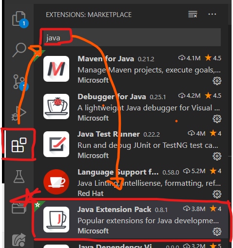

- 스프링 부트 extension pack

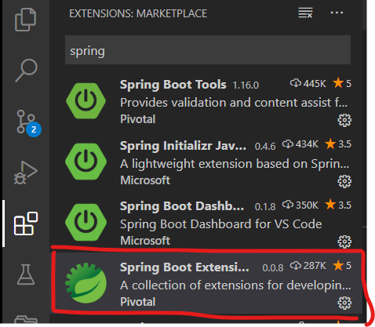

> 스프링 부트는 톰캣이 내장되어있어 서버 설치 없이도 실행가능하다.

- Lombok extension

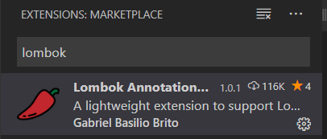

> 필수는 아니지만 개발 편의를 위해 롬복 extension을 설치한다.
>
> Lombok 디펜던시를 설정하더라도 IDE에 설치가 되어있지 않으면 롬복 사용이 불가능하다.

## 스프링 부트란?

- stand-alone 스프링 application을 만들 수 있다.

- 톰캣, 제티 언더토우를 내장시킬 수 있어서 WAR 배포가 필요없다.

- 스프링과 서드파티 라이브러리를 자동 설정해준다.

- metrics, health checks, externalized configuration과 같은 production-ready 기능들을 제공한다.

- 코드 생성 및 XML 설정이 필요 없다.

위의 항목들은 스프링 부트에서 설명하는 기능들이다.

VS 코드를 사용한 스프링 프로젝트의 걸림돌인 WAR 빌드 및 배포를 수동으로 진행하여야 한다는 점이 해결된다.

또한, 기존 스프링 프로젝트를 위해 필요했던 옵션 설정들을 자동으로 해주기 때문에 초기 설정이 잘못돼서 구동이 제대로 안되는 일이 거의 없어진다.

## 프로젝트 생성

`ctrl+shift+p` 를 눌러 커맨드 팔레트를 호출 한 뒤 Spring Initializr를 실행시킨다.

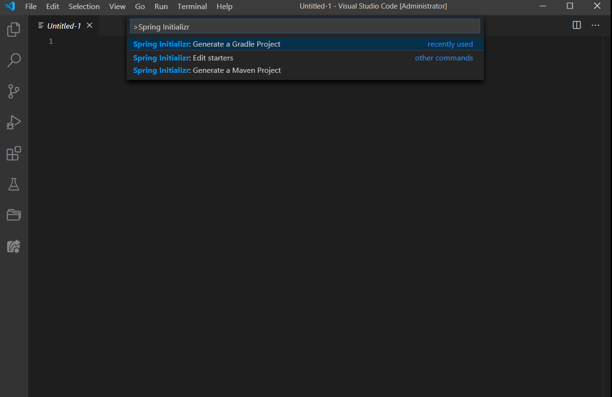

마법사를 따라 진행하다보면 디펜던시 추가를 할 수 있는 파트가 나온다. 사용할 디펜던시를 선택한 후 엔터 혹은 Selected dependencies 항목을 클릭하고 저장한다.

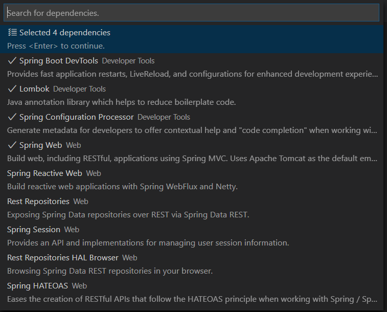

- Spring Boot DevTools : 라이브 리로드와 같은 편리한 기능 제공

- Lombok : VO 지원 도구

- Spring Configuration Processor : application yml 작성을 도와준다.

- Spring Web : MVC 패턴 구현을 위한 기본 설정을 해준다.

생성된 프로젝트 폴더를 열면 아래와 같은 구조가 생성된다.

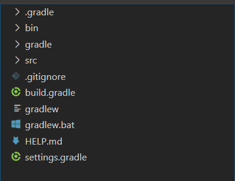

`src/main/resources/application.properties` 에 다음과 같은 설정을 추가한다.

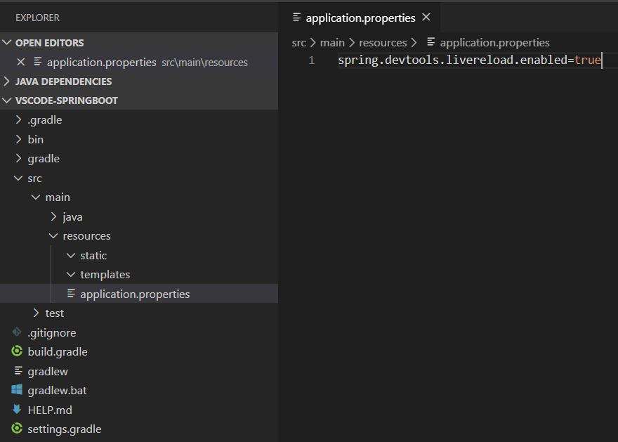

프로젝트를 실행 시킨 뒤 `localhost:8080` 으로 접근 혹은 대쉬보드의 프로젝트를 우클릭하여 `Open In Brower` 를 선택한다.

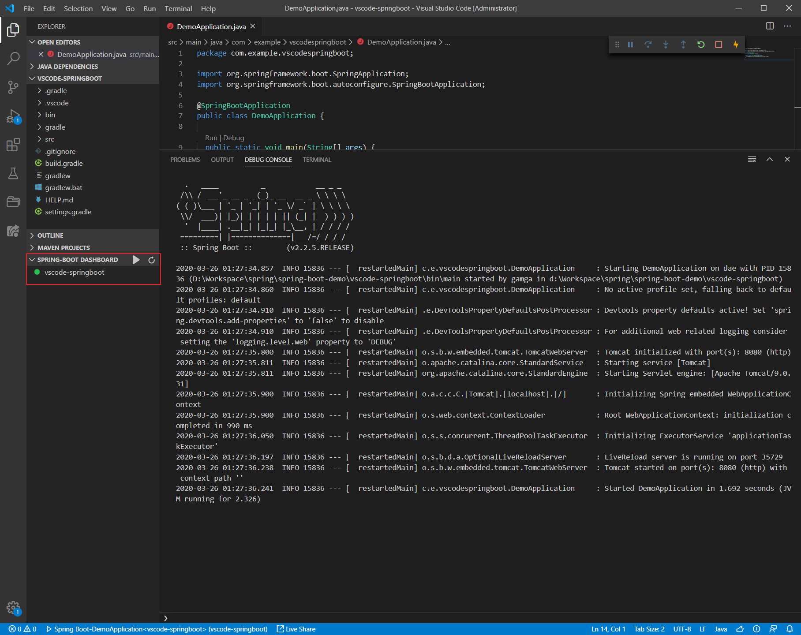

아래와 같이 로컬 서버에 접속 할 수 있다.

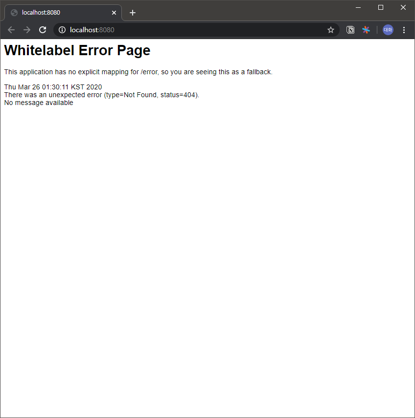

## Index 페이지 생성

`src/main/resources/static` 폴더에 `index.html` 파일을 생성해준다. 내용은 국룰에 따라 Hello World를 작성해주자.

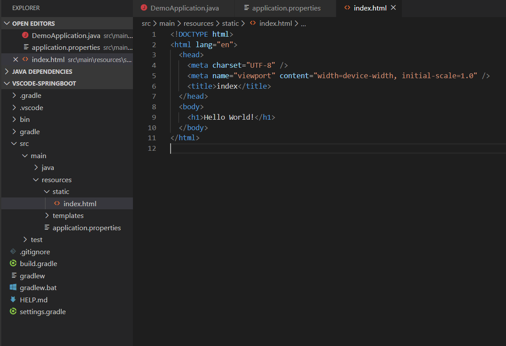

> vscode 스니펫인 `!` 혹은 `html:5` 를 사용하면 좀 더 쉽게 페이지 생성이 가능하다.
>
> 참고 : [VSCode, 코드 스니펫 (Code Snippet) - blog.azulpintor.io](https://blog.azulpintor.io/entry/snippets-in-vscode-for-html)

새로운 파일이 감지되면 Live Reloader가 감지하여 자동으로 배포 후 재실행 시켜준다. `http://localhost:8080/` 에 다시 접속 하면 작성한 `index.html` 을 확인할 수 있다.

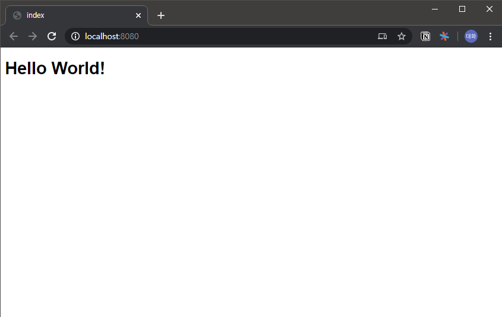

## Rest Controller 생성
